# 项目报价系统 — 操作手册

> 适用版本: backend v1.4.36 / frontend v1.3.79
> 演示报价单: 主板锁螺丝机 (quotation_id=3, status=draft)
> 系统地址: http://10.60.100.1:8080
> 文档生成日期: 2026-07-09

---

## 目录

1. [系统概述](#1-系统概述)
2. [角色与权限矩阵](#2-角色与权限矩阵)
3. [通用流程](#3-通用流程)
   - 3.1 登录 / 登出
   - 3.2 首页 Dashboard
   - 3.3 报价单列表
   - 3.4 我的分配
   - 3.5 我的消息
   - 3.6 待审批归档
4. [报价单 View — 按 Tab 详解](#4-报价单-view--按-tab-详解)
   - 4.1 基本信息
   - 4.2 模块管理
   - 4.3 物料清单
   - 4.4 参与人员
   - 4.5 费用
   - 4.6 人力工时
   - 4.7 运输包装
   - 4.8 差旅人天
   - 4.9 差旅人次
   - 4.10 版本
   - 4.11 汇总
   - 4.12 导出
   - 4.13 费用系数
5. [管理员后台](#5-管理员后台)
6. [常见问题 FAQ](#6-常见问题-faq)

---

## 1. 系统概述

**项目报价系统** 是一个多角色协同的工业设备报价系统，支持模块化报价、人力/物料/差旅成本核算、跨币种汇率、多版本快照及 PDF 导出。

**核心概念**:
- **报价单 (Quotation)**: 顶层项目实体，如 "主板锁螺丝机"、"JOT流线组件"
- **模块 (Module)**: 报价单下的分类（机构 / 电气 / PLC / 其他），按 group 分组展示
- **物料 (Material)**: 模块下的具体物料条目（含型号、单价、用量、损耗率）
- **参与人员 (Participant)**: 报价单的协作者，按 `agency/electrical/project` 三种类型分配
- **版本 (Version)**: 报价单历史快照，可对比 / 回滚 / 导出 PDF

**技术栈**: Vue 3 + Element Plus + FastAPI + PostgreSQL，部署于 Docker Swarm (swarm01/swarm02)。

---

## 2. 角色与权限矩阵

### 2.1 系统角色

系统定义 4 种用户角色 + 4 种报价单参与类型：

| 角色 | 账号 | 密码 | 默认首页 |
|---|---|---|---|
| 管理员 | `admin` | `admin123` | Dashboard |
| 报价经理 | `manager` | `manager123` | Dashboard |
| 业务员 | `sales` | `sales123` | Dashboard |
| 查看者 | `viewer` | `viewer123` | Dashboard |

### 2.2 报价单 Tab × 参与类型 权限矩阵

| Tab / 功能 | admin | manager (project) | sales (agency) | viewer (electrical) |
|---|---|---|---|---|
| 基本信息 | ✅ | ✅ | ✅ | ✅ |
| 模块管理 | ✅ | ✅ | ✅ | ✅ |
| 物料清单 | ✅ | ❌ | ✅ | ✅ |
| 参与人员 | ✅ | ✅ | ❌ | ❌ |
| 费用 | ✅ | ✅ | ❌ | ❌ |
| 人力工时 | ✅ | ✅ | ❌ | ❌ |
| 运输包装 | ✅ | ✅ | ❌ | ❌ |
| 差旅人天 | ✅ | ✅ | ❌ | ❌ |
| 差旅人次 | ✅ | ✅ | ❌ | ❌ |
| 费用系数 | ✅ (admin only) | ❌ | ❌ | ❌ |
| 版本 | ✅ | ✅ | ❌ | ❌ |
| 汇总 | ✅ | ✅ | ✅ | ❌ |
| 导出 | ✅ | ✅ | ❌ | ❌ |

### 2.3 后台管理页（仅 admin 可见）

| 页面 | 路径 | 用途 |
|---|---|---|
| 用户管理 | `/users` | 增删改查用户、分配角色 |
| 角色管理 | `/roles` | 角色权限配置 |
| 系统设置 | `/system` | 系统全局参数 |
| 参与类型权限 | `/participant-type-permissions` | project/agency/electrical 三类参与者的 tab 权限映射 |
| 原材料库 | `/materials` | 全局物料库（型号、价格、供应商） |
| 费用类型 | `/fee-types` | 费用类型字典 |
| 费用系数 | `/fee-rates` | 各类费用的默认系数 |
| 汇率配置 | `/exchange-rates` | 多币种汇率维护 |
| 差旅费用配置 | `/travel-fee-config` | 差旅单价默认值 |
| 操作日志 | `/logs` | 全系统操作审计 |
| AI 助手 | `/ai-chat` | 7 个 LLM 工具（智能搜索/反推/聚类/解释/对比/翻译/建议） |
| 报价趋势 | `/trends` | 报价数据可视化分析 |

---

## 3. 通用流程

### 3.1 登录 / 登出

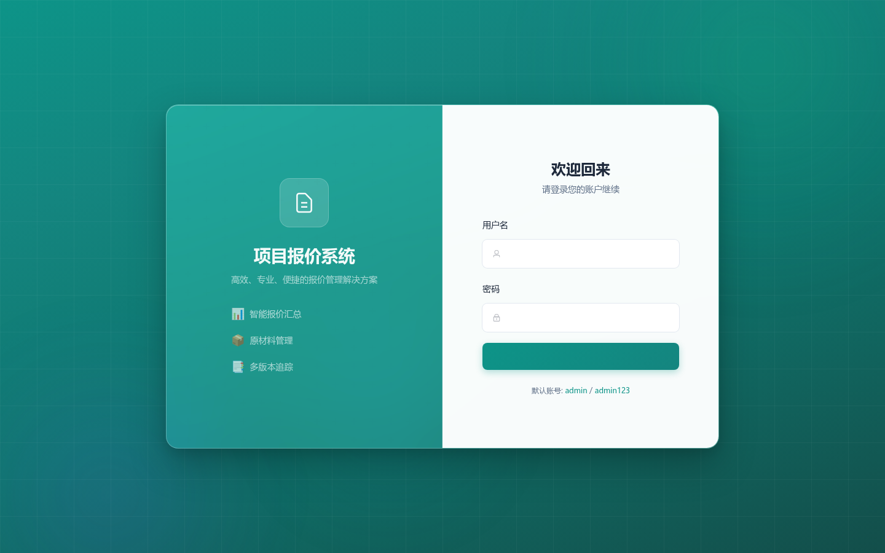

**操作步骤**:

1. 打开浏览器，访问 `http://10.60.100.1:8080`
2. 自动跳转 `/login` 页，输入**用户名**和**密码**
3. 点击右下角 **登 录** 按钮（或按 Enter）
4. 登录成功后跳转 `/dashboard` 首页
5. 登录失败会显示红色错误提示："用户名或密码错误"

**登出**: 左下角用户卡片 → 红色 **退出登录** 按钮 → 回到登录页。

**注意**:
- 系统使用 JWT Token（7 天有效期），存储在 `localStorage.token`
- 关闭浏览器不会登出；切换账号前必须先登出
- 首次登录后建议修改默认密码

### 3.2 首页 Dashboard

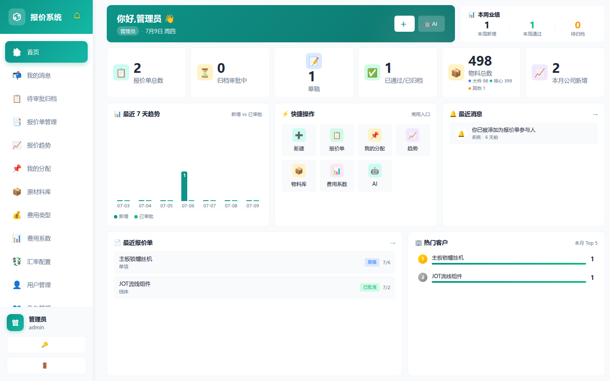

**操作步骤**:

1. 登录后自动进入首页
2. 顶部展示**欢迎语** + 当前角色徽章
3. 中部展示 **4 张 KPI 卡片**（报价单总数、待审批数、本月新增、参与报价单数）
4. 下部展示 **待办事项列表**（按角色不同）：
   - admin: 系统告警 + 全公司待审批
   - manager: 自己负责的报价单
   - sales: 自己作为 agency 参与的报价单
   - viewer: 自己作为 electrical 参与的报价单

**快捷入口**: 顶部 KPI 卡片可点击进入对应列表页。

### 3.3 报价单列表

**操作步骤**:

1. 左侧导航 → **报价单管理**
2. 默认显示**所有可见报价单**（admin 看全部，其他角色看自己参与的）
3. 顶部筛选区：
   - **状态** 下拉：草稿/审批中/已审批/已归档/已驳回/已取消/审批中待定
   - **类型** 下拉：单项/线体/工装
   - **搜索框**：按名称、方案号模糊搜索
4. 表格列：项目名称、方案号、类型、状态、项目落地、创建人、操作
5. **状态彩色徽章**：
   - 草稿 (草稿) 灰色
   - 审批中 (审批中) 蓝色
   - 已审批 (已审批) 绿色
   - 已归档 (已归档) 紫色
   - 已驳回 (已驳回) 红色
   - 已取消 (已取消) 灰色
   - 审批中待定 (审批中待定) 橙色
6. 点击 **项目名称** 进入 view 页；点击 **+ 按钮** 创建新报价单

**注意**:
- admin 默认看不到自己不是 participant 的报价单的 tab 列表（必须在"参与人员" tab 加自己）
- admin 看列表用 `/quotations`，其他角色用 `/my-assignments` 进入"我的分配"

### 3.4 我的分配

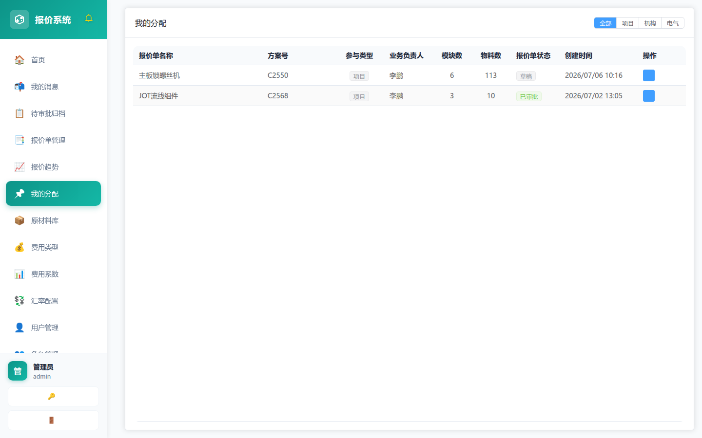

**操作步骤**:

1. 左侧导航 → **我的分配**
2. 默认显示**所有状态**的报价单，可按状态筛选
3. 每行展示：项目名称、方案号、状态、分配时间、操作
4. **分配状态**（彩色徽章）：
   - 待开始 (info) 灰色
   - 进行中 (primary) 蓝色
   - 已完成 (success) 绿色
   - 已驳回 (danger) 红色
   - 已取消 (info) 灰色
   - 审批中 (warning) 橙色
   - 审批中待定 (warning) 橙色

**业务逻辑**:
- 此页面专门用于**跨报价单查看自己被分配的模块任务**
- 与报价单列表的区别：本页只显示**模块分配**（business_owner 创建的报价单中分给我的模块任务）

### 3.5 我的消息

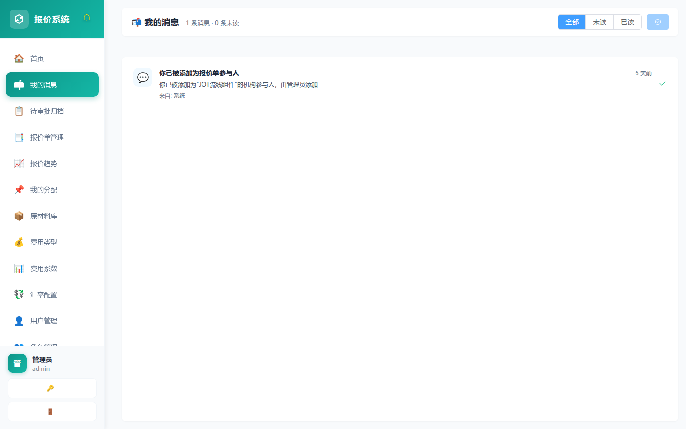

**操作步骤**:

1. 左侧导航 → **我的消息**
2. 系统内通知列表：审批结果、@ 提及、分配提醒
3. 未读消息**红色徽章**标在左侧导航
4. 点击消息跳转对应报价单 / 模块

### 3.6 待审批归档

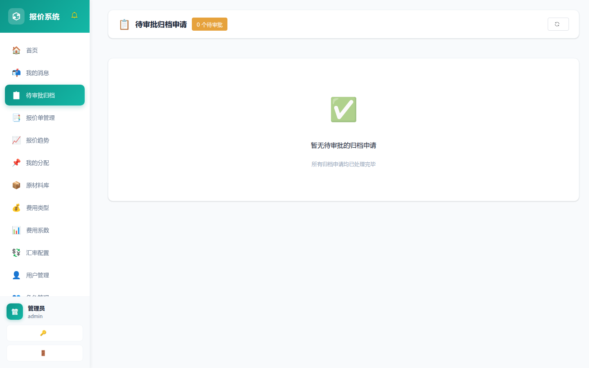

**操作步骤**:

1. 左侧导航 → **待审批归档**
2. 仅**报价单创建者 + admin** 可见
3. 列表展示当前等待审批人确认归档的报价单
4. 审批操作：**通过 / 驳回 / 撤回**

---

## 4. 报价单 View — 按 Tab 详解

> 演示报价单: 主板锁螺丝机 (id=3)
> URL: `/quotations/3/view`
> 顶部标题: "编辑报价单 - 主板锁螺丝机"

### 4.1 基本信息

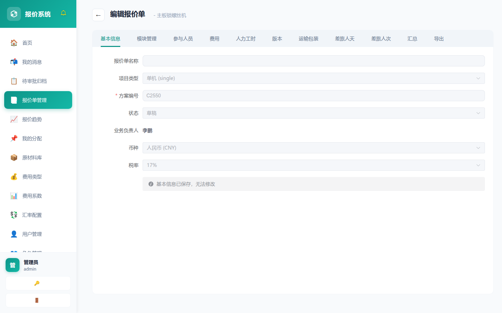

**Tab 顺序**: 第 1 个，**所有角色都可见**。

**操作步骤**:

1. 点击顶部 **基本信息** tab
2. 看到表单字段：
   - **项目名称**（必填）
   - **方案号**（必填，唯一）
   - **类型**: 单项 / 线体 / 工装
   - **状态**: 草稿 / 审批中 / 已审批 / 已归档
   - **项目落地**: 客户名称 + 地点
   - **客户联系人** + **联系方式**
   - **创建人**（自动填充）
   - **创建时间**（自动填充）
3. 修改字段 → 点右下角 **保存** 按钮 → 成功提示 "保存成功"

**注意**:
- 状态变为"已审批"后不能再编辑（需先撤销归档）
- 草稿状态可任意修改
- 方案号重复会报错 "方案号已存在"

### 4.2 模块管理

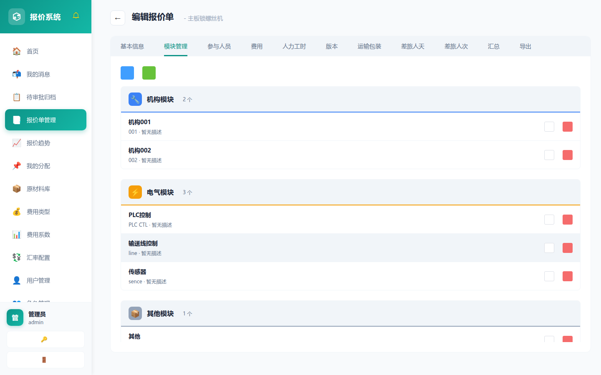

**Tab 顺序**: 第 2 个，**所有角色都可见**。

**操作步骤**:

1. 点击 **模块管理** tab
2. 看到 **4 个分组卡片**（按 module.type 分组）：
   - 🔵 **机构模块** (agency type)
   - 🟢 **电气模块** (electrical type)
   - ⚡ **PLC 模块** (project type)
   - 📦 **其他模块** (other)
3. 每个分组卡片显示该类型下模块数量徽章
4. 模块列表项包含：模块名、模块编号、描述
5. **新建模块**: 右上角 ➕ → 弹窗填写 → 选择所属分组 → 保存
6. **删除模块**: 模块右侧 🗑️ 红色按钮 → 确认弹窗 → 删除

**跨报价单复制模块**:
1. 点击 **从其他报价单复制模块** 按钮（在 Tab 右上方）
2. 弹窗显示分页 table，列出**所有可见报价单的所有模块**（不限人员）
3. 顶部搜索框可按模块名 / 报价单名搜索
4. 分页条支持 10/20/50 条/页
5. 单击某行选中 → **复制选中模块** 按钮 → 自动追加到当前报价单

**注意**:
- 删除模块会**级联删除**该模块下的所有物料
- 复制模块时只复制**模块结构**，不复制物料数据
- 已审批的报价单不能新建/删除模块

### 4.3 物料清单

**Tab 顺序**: 第 6 个，**sales / viewer / admin 可见**，**manager 不可见**。

**操作步骤**:

1. 点击 **物料清单** tab
2. 看到 **模块树** + **物料表** 双栏布局：
   - 左侧树状图：选中模块 → 右侧显示该模块的物料
3. 物料表格列：序号、物料名、规格型号、单位、用量、损耗率、单价、含系数价、合计
4. **新增物料**: 右上 ➕ → 弹窗选择原材料库 → 自动填充单价 → 输入用量/损耗率
5. **批量导入**: 上传 Excel 模板 → 解析 → 预览 → 确认
6. **导出 Excel**: 右上角 ↓ 按钮

**聚合视图**:
- 顶部 **按汇总聚合** 切换：相同物料（型号 + 规格）合并显示
- "数量+2" 模式：按机构/电气/PLC 三个分组分别显示
- 默认按模块 + 物料分组

**注意**:
- 物料的单价 × 用量 × (1 + 损耗率) = 含系数价
- "其他成本锁死"假设：物料不变时，修改系数只调整其他费用部分
- "数量+2" 模式下，删除物料必须按 mm.id（ModuleMaterial 主键）而非 material_id，否则会误合并

### 4.4 参与人员

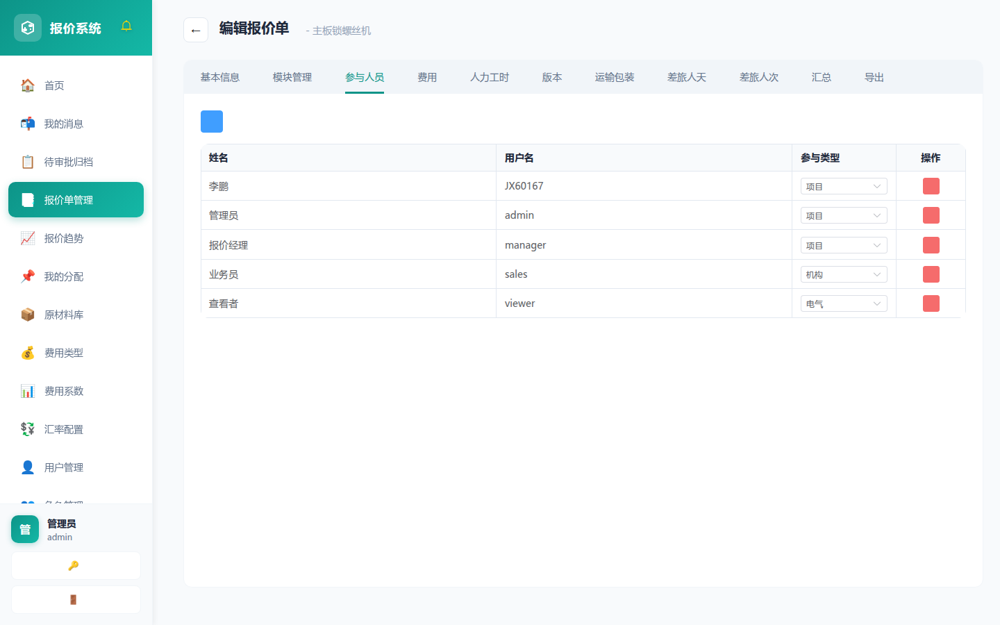

**Tab 顺序**: 第 3 个，**仅 manager / admin 可见**。

**操作步骤**:

1. 点击 **参与人员** tab
2. 表格列：用户、类型 (agency/electrical/project)、角色、状态、操作
3. **添加参与者**: 右上 ➕ → 弹窗选择用户 + 类型 + 角色 → 保存
4. **修改类型**: 点击类型列的下拉框
5. **移除参与者**: 右侧 🗑️ 红色按钮

**业务逻辑**:
- **agency 类型**: 可看模块/物料/汇总 tab（业务员视角）
- **electrical 类型**: 仅可看模块/物料 tab（电气工程师视角）
- **project 类型**: 全 tab 可见（项目经理视角）
- admin 自动看全 tab 仅当被加成 participant

### 4.5 费用

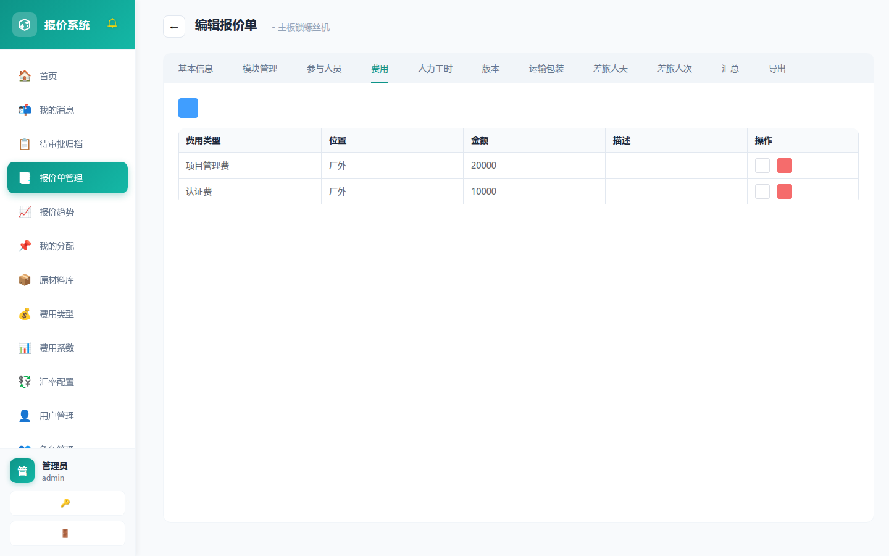

**Tab 顺序**: 第 4 个，**仅 manager / admin 可见**。

**操作步骤**:

1. 点击 **费用** tab
2. 看到**费用类型列表**：运输、包装、安装、调试、培训等
3. 每种费用显示：费用名、单位、单价、用量、合计、备注
4. **新增费用项**: ➕ → 弹窗填写
5. **引用费用系数**: 顶部"费用系数"按钮 → 选择预设模板

### 4.6 人力工时

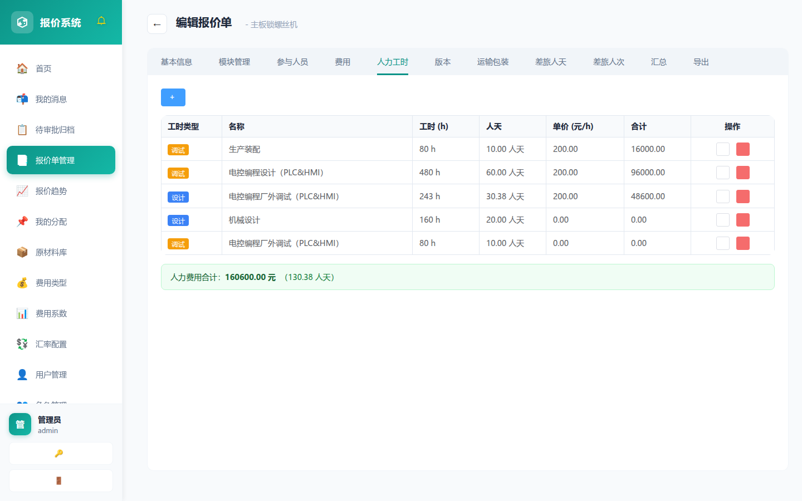

**Tab 顺序**: 第 5 个，**仅 manager / admin 可见**。

**操作步骤**:

1. 点击 **人力工时** tab
2. 表格列：工种、人数、工时、单价、合计
3. 预设工种：装配工、电工、工程师、调试员
4. **批量计算**: 输入总工时 → 自动按工种分配
5. **工时单价维护**: 顶部链接跳转 `/travel-fee-config`

### 4.7 运输包装

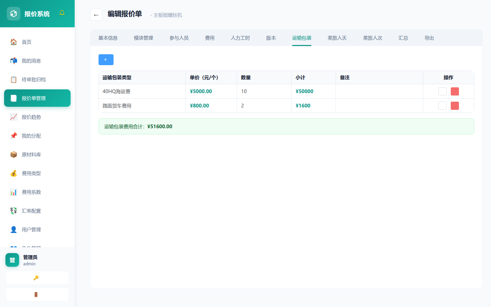

**Tab 顺序**: 第 7 个，**仅 manager / admin 可见**。

**操作步骤**:

1. 点击 **运输包装** tab
2. 包含：**包装方式**（木箱 / 纸箱 / 托盘）+ **运输方式**（汽运 / 海运 / 空运）+ **距离**（km）+ **单价**
3. 合计 = 包装费 + 运输费

### 4.8 差旅人天

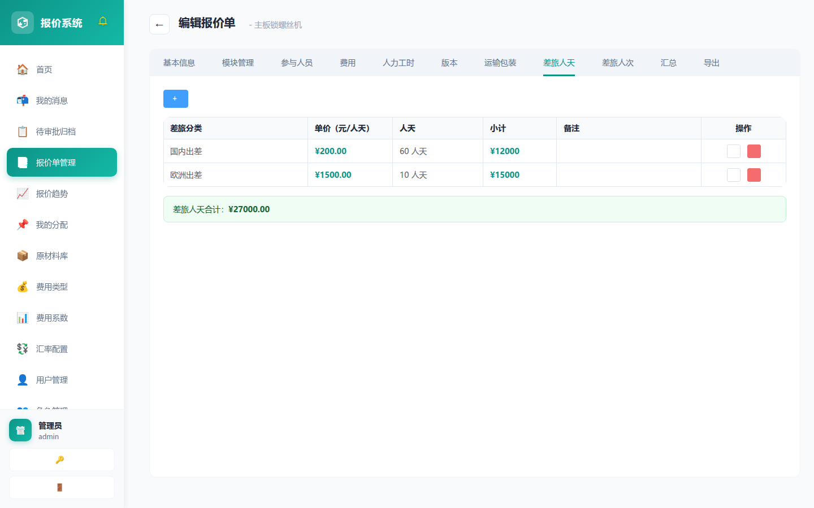

**Tab 顺序**: 第 8 个，**仅 manager / admin 可见**。

**操作步骤**:

1. 点击 **差旅人天** tab
2. 表格列：人员类型、人数、天数、住宿费、餐补、合计
3. **自动计算**: 人数 × 天数 × (住宿 + 餐补) = 合计

### 4.9 差旅人次

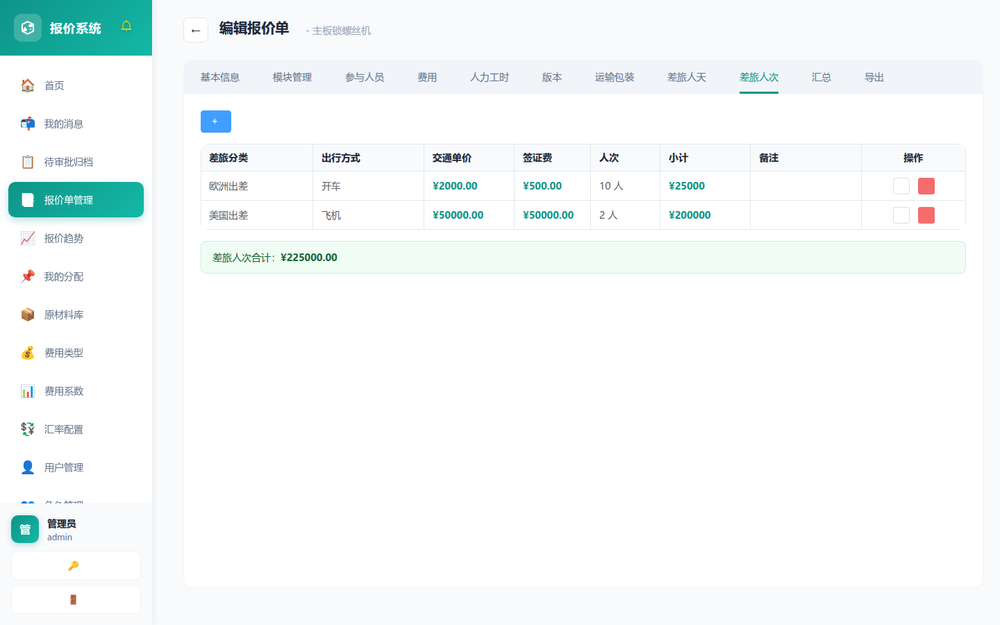

**Tab 顺序**: 第 9 个，**仅 manager / admin 可见**。

**操作步骤**:

1. 点击 **差旅人次** tab
2. 表格列：人员、出发地、目的地、交通工具、单程价、往返次数、合计
3. 与"差旅人天"配合：人天 = 住宿成本，人次 = 交通成本

### 4.10 版本

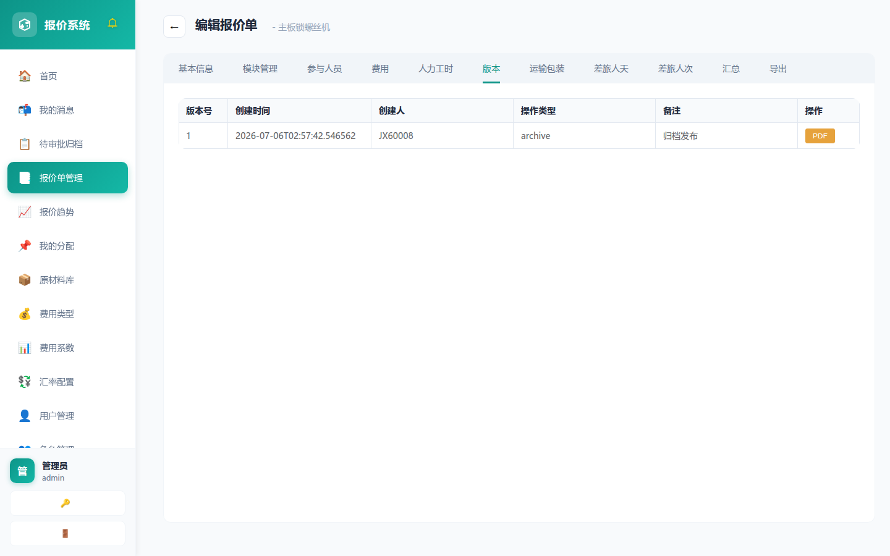

**Tab 顺序**: 第 10 个，**仅 manager / admin 可见**。

**操作步骤**:

1. 点击 **版本** tab
2. **版本列表**: 显示历史快照（每次保存自动创建）
3. 列：版本号、创建时间、创建人、备注、操作
4. **查看快照**: 点击 → 显示该版本完整数据
5. **对比**: 勾选两个版本 → **对比** 按钮 → 显示 diff
6. **回滚**: 历史版本 → **回滚到此版本** 按钮 → 确认

### 4.11 汇总

**Tab 顺序**: 第 12 个，**admin / manager / sales 可见**，**viewer 不可见**。

**操作步骤**:

1. 点击 **汇总** tab
2. 顶部 **6 张分组卡片**（永远显示全部分组，无数据时为 0 + "暂无数据"）：
   - 物料成本（含系数）
   - 人工成本
   - 差旅成本
   - 运输包装
   - 费用系数
   - **总价**
3. 下方 **分模块明细 table**：模块名、各分类金额、模块合计
4. **导出汇总 PDF**: 右上角按钮 → 浏览器自动下载 PDF
5. **目标价反推**: 顶部"目标价"输入框 → 输入目标金额 → **反推系数** → 系统自动建议各分组调整

**注意**:
- 汇总页面所有**百分比**精确到小数点后两位 (`(x*100).toFixed(2)%`)
- 物料差异 key 用 mm.id (ModuleMaterial 主键) 而非 material_id
- "其他成本锁死"假设：物料不变时修改系数只调整其他费用

### 4.12 导出

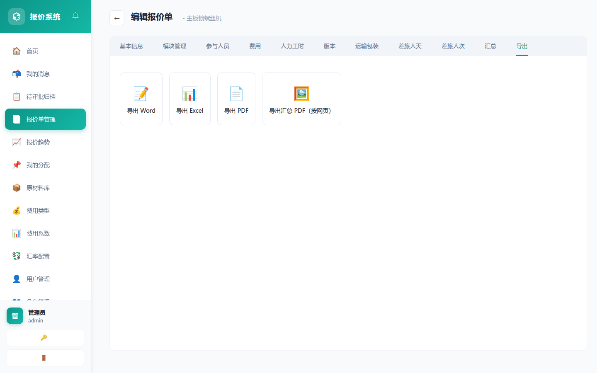

**Tab 顺序**: 第 11 个，**仅 manager / admin 可见**。

**操作步骤**:

1. 点击 **导出** tab
2. 看到 **4 个导出选项**：
   - **报价单 PDF**（完整版，含模块/物料/费用/汇总）
   - **汇总 PDF**（仅汇总数据）
   - **物料 Excel**（按当前筛选）
   - **版本快照 PDF**（指定版本）
3. 选择导出项 → **开始导出** → 浏览器下载

### 4.13 费用系数

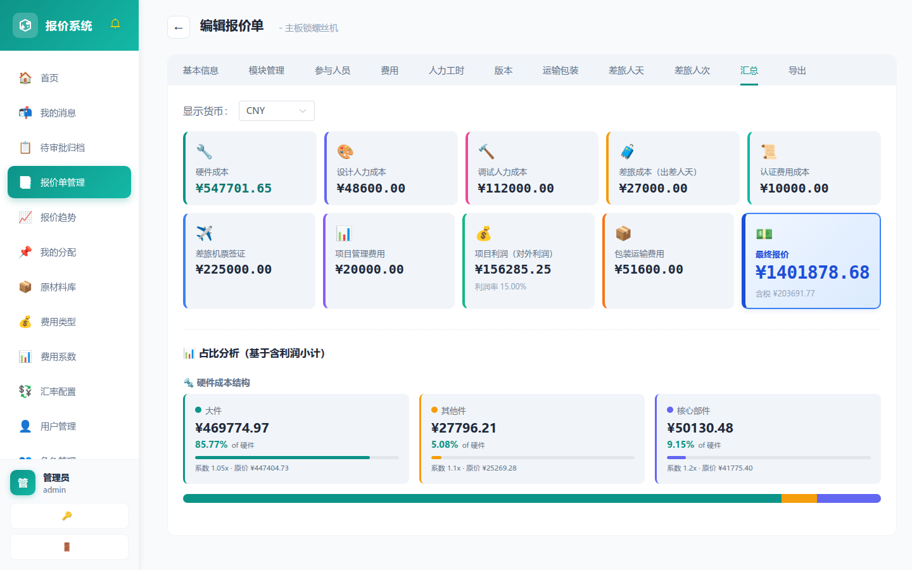

**Tab 顺序**: 第 13 个，**仅 admin 可见**。

**操作步骤**:

1. 点击 **费用系数** tab
2. 看到**大件/核心/其他件**三类物料的系数配置
3. 每类可单独设置系数（不用统一倍数）
4. **基数分配模式**: 拒绝"全料同一系数"
5. 输入目标价 → **智能推荐** → 系统按 `rate_details[cat].base / sum(base)` 权重分配

---

## 5. 管理员后台

### 5.1 用户管理

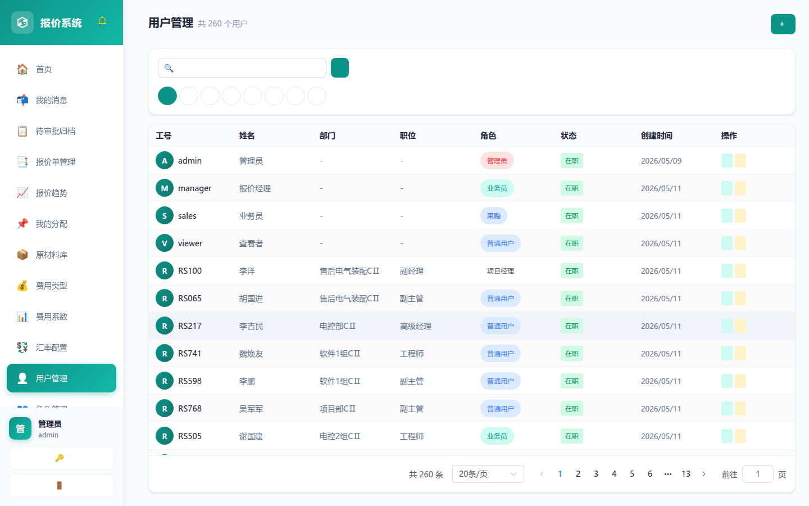

**操作步骤**:

1. 左侧导航 → **用户管理**（admin 专属）
2. 表格列：用户名、真实姓名、邮箱、角色、状态、创建时间、操作
3. **新增用户**: ➕ → 弹窗填写用户名/密码/姓名/邮箱/角色 → 保存
4. **修改用户**: 点击编辑图标 → 修改 → 保存
5. **禁用用户**: 状态列的开关
6. **重置密码**: 右侧菜单 → 重置密码 → 输入新密码

### 5.2 角色管理

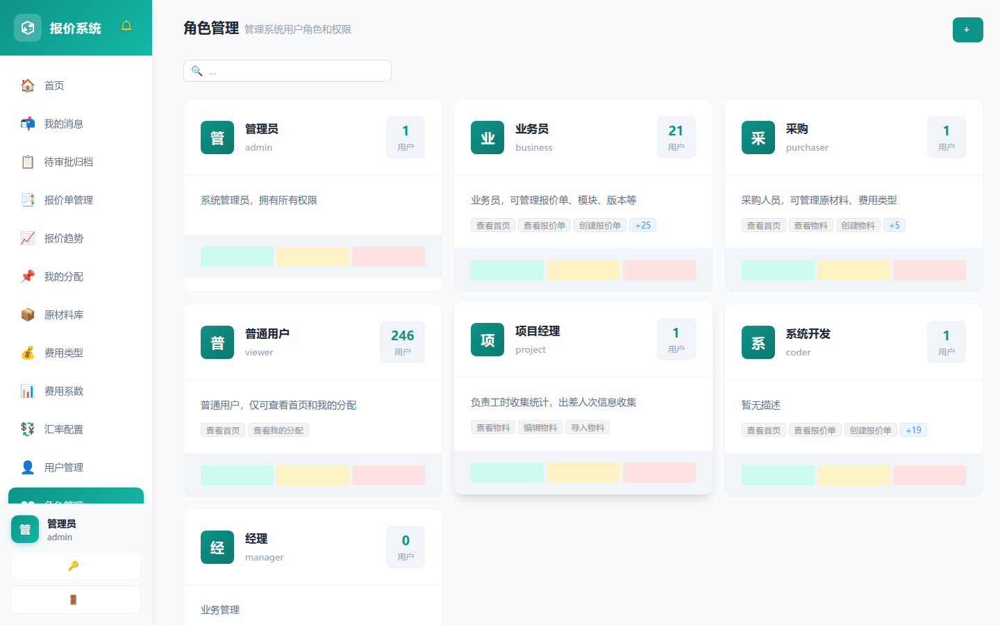

**操作步骤**:

1. 左侧导航 → **角色管理**
2. 表格列：角色名、描述、权限数量、用户数、操作
3. **编辑权限**: 点击权限数字 → 弹窗勾选权限 → 保存
4. **新建角色**: ➕ → 命名 + 选择权限 → 保存

### 5.3 系统设置

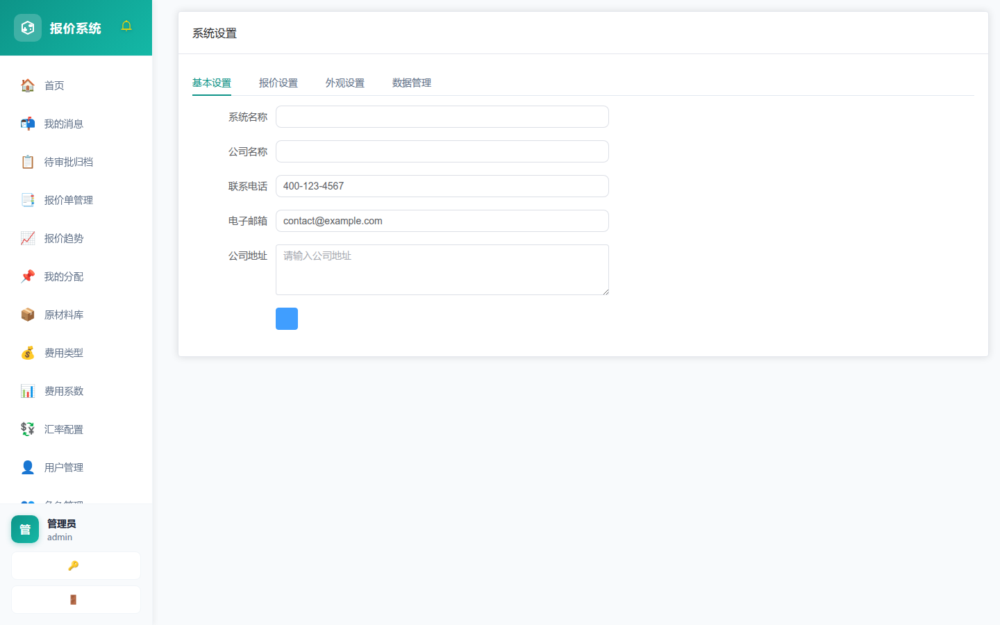

**操作步骤**:

1. 左侧导航 → **系统设置**
2. 全局参数：默认币种、税率、PDF logo、邮件模板
3. 修改 → **保存设置**

### 5.4 参与类型权限

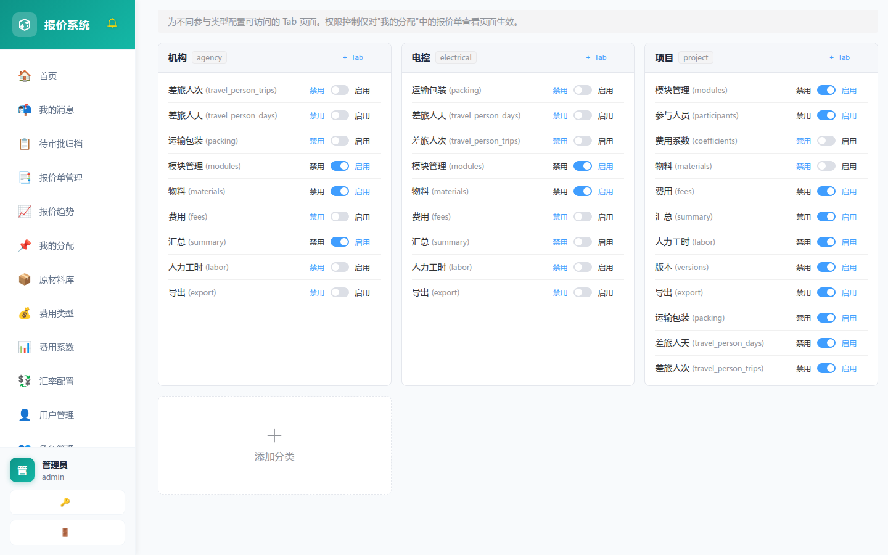

**操作步骤**:

1. 左侧导航 → **参与类型权限**
2. 三列权限矩阵：project / agency / electrical × tab 名
3. 勾选 → 自动保存
4. 例：勾选 sales.agency.materials 开启业务员看物料清单

### 5.5 原材料库

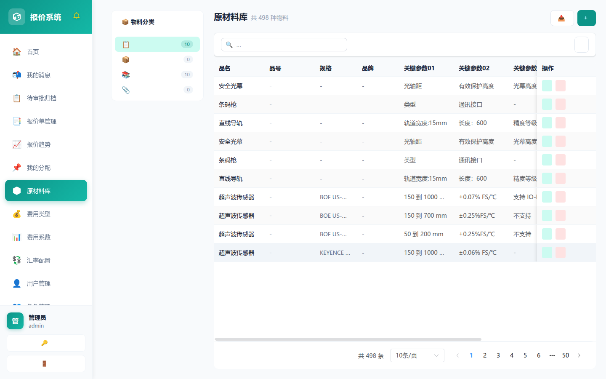

**操作步骤**:

1. 左侧导航 → **原材料库**
2. 全局物料字典：型号、规格、单价、供应商、备注
3. **新增物料**: ➕ → 弹窗填写 → 保存
4. **批量导入**: 上传 Excel 模板
5. 报价单的物料 tab 引用此表

### 5.6 费用类型

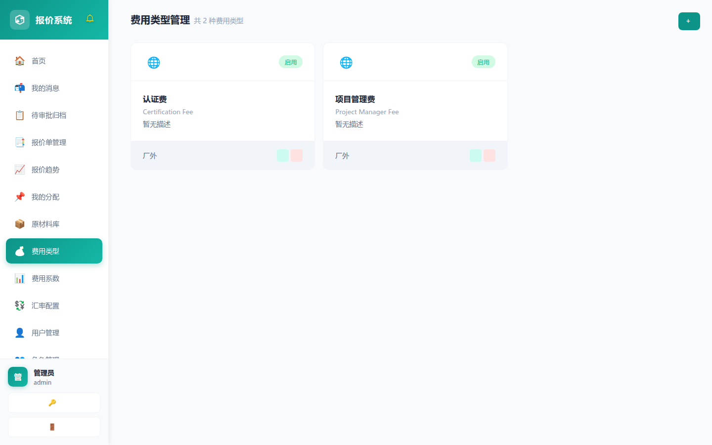

**操作步骤**:

1. 左侧导航 → **费用类型**
2. 费用字典：运输、包装、安装、调试、培训等
3. 增删改查操作

### 5.7 费用系数

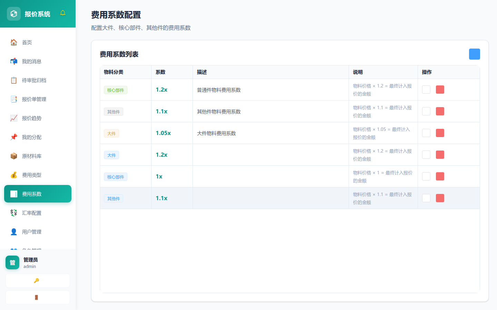

**操作步骤**:

1. 左侧导航 → **费用系数**（admin 后台）
2. 各类费用的默认系数配置
3. 报价单"费用" tab 引用

### 5.8 汇率配置

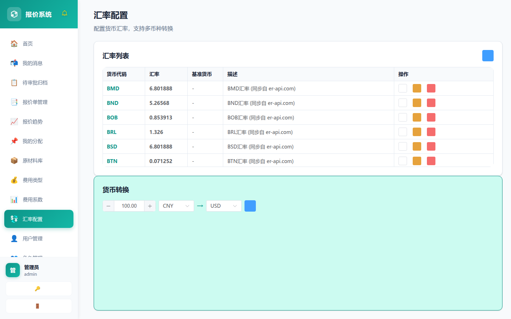

**操作步骤**:

1. 左侧导航 → **汇率配置**
2. 多币种汇率维护：CNY/USD/EUR/JPY
3. 表格列：源币种、目标币种、汇率、生效日期、操作
4. **新增汇率**: ➕ → 弹窗 → 保存

### 5.9 差旅费用配置

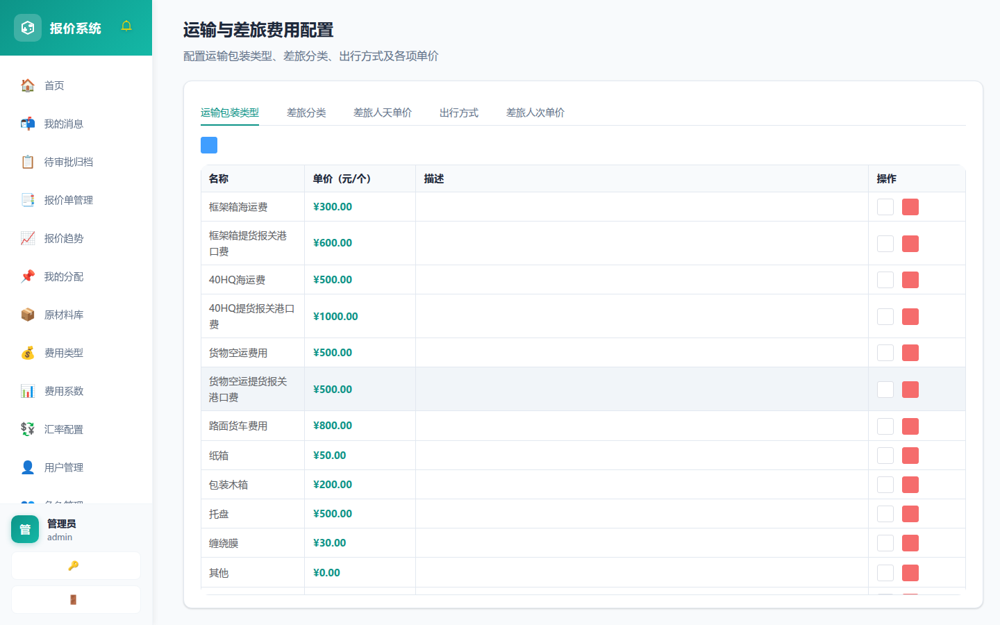

**操作步骤**:

1. 左侧导航 → **差旅费用配置**
2. 差旅单价默认值：住宿、餐补、交通
3. 报价单的"差旅人天"/"差旅人次" tab 引用

### 5.10 操作日志

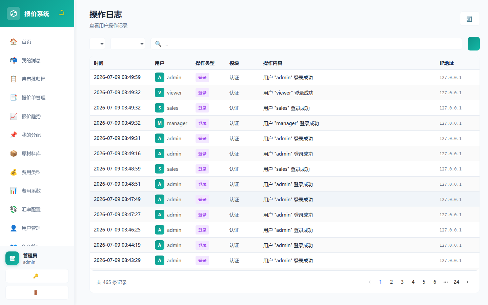

**操作步骤**:

1. 左侧导航 → **操作日志**
2. 全系统操作审计：登录、创建、修改、删除、审批
3. 列：时间、用户、操作类型、对象、IP、结果
4. **筛选**: 按时间范围 / 用户 / 操作类型

### 5.11 AI 助手

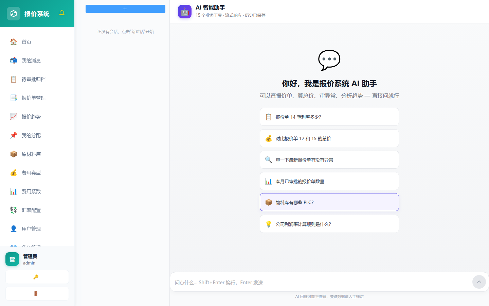

**操作步骤**:

1. 左侧导航 → **AI 助手**
2. **7 个 LLM 工具**:
   - 🔍 **智能搜索**: 自然语言查询报价单 / 物料
   - 🎯 **反推工具**: 输入目标价 → 反推各分类系数
   - 📊 **聚类分析**: 报价数据聚类
   - 💡 **解释助手**: 选择单元格 → 解释计算逻辑
   - ⚖️ **对比工具**: 两个报价单对比
   - 🌐 **翻译**: 多语言翻译
   - 📝 **建议生成**: 自动生成报价说明

### 5.12 报价趋势

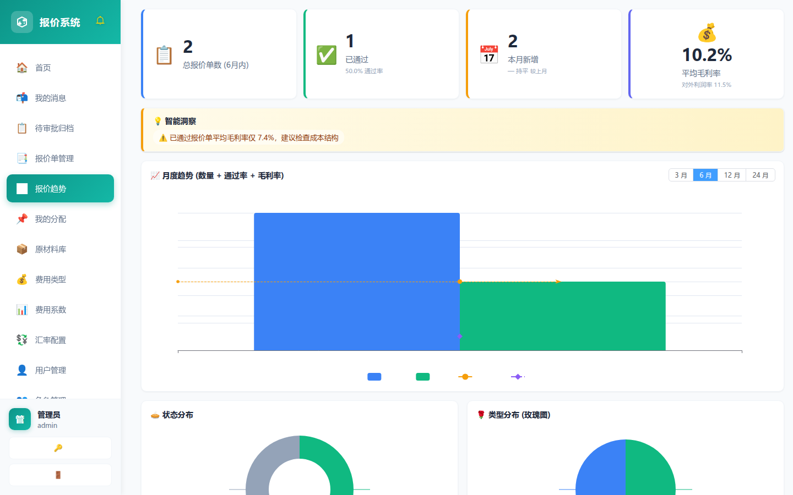

**操作步骤**:

1. 左侧导航 → **报价趋势**
2. 数据可视化：报价金额趋势、类型分布、状态分布
3. 时间范围筛选 + 图表切换

---

## 6. 常见问题 FAQ

### Q1: 报价单列表是空的？

A: 你的账号**没有被加入任何报价单的参与人员**。请 admin 在该报价单的"参与人员" tab 添加你，选择合适的类型（agency/electrical/project）。

### Q2: 看不到某个 Tab？

A: 该 Tab 对你当前的参与类型不可见。参考 §2.2 权限矩阵。例如业务员（agency）看不到"参与人员"/"费用"/"差旅" tab。

### Q3: 状态已审批后还能修改吗？

A: 不能。需先在"待审批归档"页 **驳回** 或 **撤销归档** 回到草稿状态。

### Q4: 删除模块会丢失物料吗？

A: **会**。删除模块会级联删除该模块下的所有物料和 ModuleMaterial 关联。删除前建议先创建版本快照。

### Q5: 汇总页百分比显示不对？

A: 汇总页所有百分比精确到小数点后两位（`toFixed(2)`），默认显示 `0.00%`。如果显示为整数，检查浏览器缓存（Ctrl+F5）。

### Q6: 导出 PDF 报 `Cannot read properties of null (reading 'querySelectorAll')`？

A: 这是已修复的 bug（v1.3.77+）。原因：拆组件后 `summaryRef` 指向子组件实例而非 DOM。修复：使用 `summaryRef.value?.summaryRef` 获取真实 DOM。请升级到 frontend v1.3.77+。

### Q7: 分配报价单状态不全？

A: 状态枚举包括：待开始 / 进行中 / 已完成 / 已驳回 / 已取消 / 审批中 / **审批中待定**。如果某个状态没显示，请升级到 frontend v1.3.78+（该版本补全了 `approved_pending` 映射）。

### Q8: AI 助手没有响应？

A: 检查后端 LLM 服务是否在线。AI 助手页面右下角有状态指示器。离线模式下返回 fallback 响应。

### Q9: 跨报价单复制模块看不到其他报价单？

A: 升级到 backend v1.4.36+（已添加 `GET /api/quotations/all-modules` 接口）。admin 看全部，普通用户按参与过滤。

### Q10: 物料清单 tab 显示但看不到？

A: 即使有 view 权限，没有 edit 权限时该 tab 可能仍隐藏。检查 `permissions.tabs` 是否包含 'materials'。

---

## 附录 A: API 快速参考

| 路径 | 方法 | 用途 |
|---|---|---|
| `/api/auth/login` | POST | 登录拿 token |
| `/api/quotations` | GET | 报价单列表（分页） |
| `/api/quotations/{id}` | GET | 报价单详情 |
| `/api/quotations/{id}/permissions` | GET | 当前用户在报价单的 tab 权限 |
| `/api/quotations/all-modules` | GET | 跨报价单查所有模块（admin 看全部） |
| `/api/modules/{id}` | DELETE | 删除模块（级联物料） |
| `/api/users` | GET | 用户列表（admin） |

## 附录 B: 数据库表

| 表名 | 用途 |
|---|---|
| `users` | 用户 |
| `roles` | 角色 |
| `role_permissions` | 角色-权限映射 |
| `quotations` | 报价单 |
| `modules` | 模块 |
| `materials` | 物料 |
| `module_materials` | 模块-物料关联 |
| `quotation_participants` | 报价单参与人员 |
| `quotation_versions` | 报价单版本快照 |
| `system_logs` | 操作日志 |

---

**文档版本**: 1.0
**截图数量**: 69 张
**生成时间**: 2026-07-09
**截图脚本**: `scripts/screenshot_pages.py`
**截图目录**: `docs/manual_screenshots/`