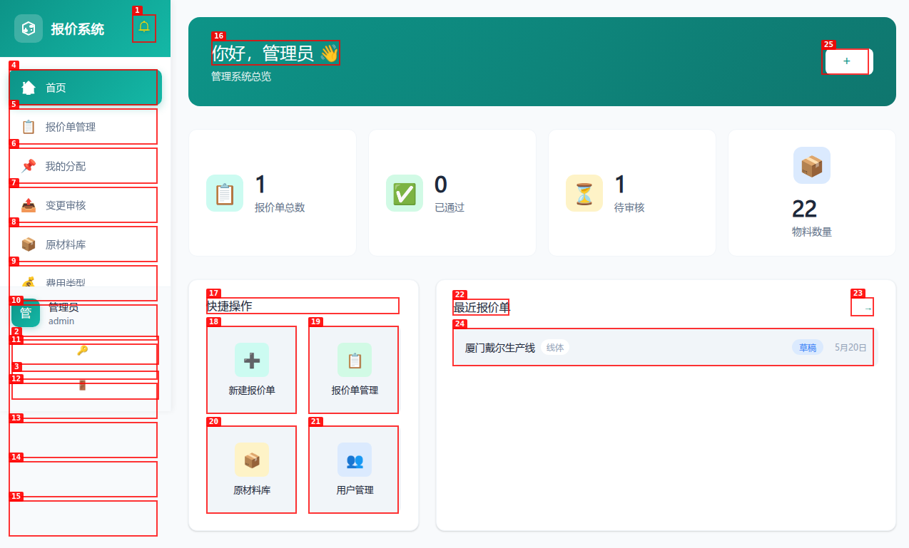
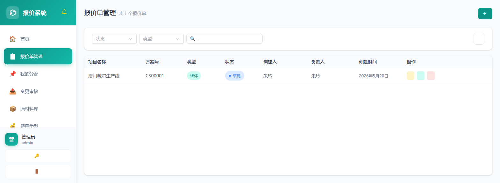

# 项目报价系统 使用说明书

> **系统地址**：http://10.60.100.1:9005  
> **默认账号**：admin / admin123  
> **版本**：v1.0

---

## 1. 系统登录

打开浏览器访问 `http://10.60.100.1:9005`，进入登录页面。


**登录步骤：**
1. 输入用户名（默认：`admin`）
2. 输入密码（默认：`admin123`）
3. 点击「登录」按钮

---

## 2. 首页仪表盘

登录成功后进入首页，显示欢迎信息、快捷操作和最近报价单。



### 侧边栏导航

| 图标 | 菜单 | 说明 |
|------|------|------|
| 🏠 | 首页 | 系统首页仪表盘 |
| 📋 | 报价单管理 | 查看/管理所有报价单 |
| 📌 | 我的分配 | 当前用户被分配的报价单 |
| 📤 | 变更审核 | 审核报价单变更申请 |
| 📦 | 原材料库 | 物料品名、规格、品牌、价格管理 |
| 💰 | 费用类型 | 费用项目分类（人力/物流等） |
| 📊 | 费用系数 | 各项费用的计算系数 |
| 💱 | 汇率配置 | 系统适用汇率管理 |
| 👤 | 用户管理 | 用户账号管理 |
| 👥 | 角色管理 | 角色及权限分配 |
| 🔐 | 参与人权限 | 项目参与人数据权限设置 |
| 📝 | 操作日志 | 所有操作行为记录 |

### 快捷操作
点击卡片可快速跳转到对应功能页面。

---

## 3. 报价单管理

管理所有报价单，支持筛选、搜索、新建、编辑、删除、归档。



**功能按钮：**

| 按钮 | 功能 |
|------|------|
| + 新建报价单 | 创建新的报价单 |
| 状态筛选 | 按草稿/审批中/已通过/已归档筛选 |
| 类型筛选 | 按线体/项目/备件筛选 |
| 搜索 | 按项目名称关键字搜索 |

**列表操作：** 归档 / 编辑 / 删除

---

## 4. 新建/编辑报价单

点击「新建报价单」或列表中「编辑」进入报价单编辑页面。

### 页面结构

```
┌─────────────────────────────────────────────────────────┐
│  ← 返回列表              [保存草稿]  [提交审核]         │
├─────────────────────────────────────────────────────────┤
│  项目信息                                               │
│  ┌───────────────────────────────────────────────────┐ │
│  │ 项目名称: [________________]  方案号: [CS00001]   │ │
│  │ 客户名称: [________________]  类型: [线体 ▼]     │ │
│  │ 负责人:   [选择 ▼]         币种: [人民币 ▼]     │ │
│  └───────────────────────────────────────────────────┘ │
│                                                         │
│  报价明细                               [+ 添加物料]     │
│  ┌───────────────────────────────────────────────────┐ │
│  │ 物料 │ 规格 │ 品牌 │ 分类 │ 单位 │ 单价 │ 数量 │小计│ │
│  │ [选择▼]│[...]│[...]│[...]│ 个  │ ¥25 │ [1] │¥25│[删除]│
│  └───────────────────────────────────────────────────┘ │
│                                                         │
│  费用明细                               [+ 添加费用]     │
│  ┌───────────────────────────────────────────────────┐ │
│  │ 费用名称   │ 费用类型 │ 系数 │ 金额   │ 操作     │ │
│  │ 人力成本   │ 人力费用 │1.00 │ ¥5,000 │ [删除]   │ │
│  │ 物流运输   │ 物流费用 │1.00 │ ¥800   │ [删除]   │ │
│  └───────────────────────────────────────────────────┘ │
│  ────────────────────────────────────────────────────  │
│  物料合计: ¥25        费用合计: ¥5,800               │
│  税率 (10%): ¥582.50                                   │
│  报价总计: ¥6,407.50                                  │
│  备注: [                                           ]  │
└─────────────────────────────────────────────────────────┘
```

### 费用合计计算规则

```
总计 = (物料合计 + 费用合计) × (1 + 税率)
```

---

## 5. 原材料库

管理报价单可引用的物料，包括品名、规格、品牌、分类、单位、单价。

### 分类标签（侧边）
- 📋 全部 / 📦 大件 / 📚 核心部件 / 📎 其他件

### 功能
- **新增物料**：填写品名/规格/品牌/分类/单位/单价
- **批量导入**：下载模板填写后上传
- **搜索**：品名/规格/品牌关键字搜索
- **编辑/删除**：修改或移除物料

### 物料字段说明

| 字段 | 说明 |
|------|------|
| 品名 | 物料名称 |
| 规格 | 物料规格型号 |
| 品牌 | 品牌/厂商 |
| 分类 | 大件 / 核心部件 / 其他件 |
| 单位 | 个/盒/卷/套/包/台/根 等 |
| 单价 | 单价（元），人民币 |

---

## 6. 费用类型

管理报价单中可引用的费用项目分类。

| 费用名称 | 英文名称 | 费用系数 |
|----------|----------|----------|
| 人力费用 | labor_cost | 1.00 |
| 物流费用 | logistics_cost | 1.00 |
| 包装费用 | packaging_cost | 1.00 |
| 安装费用 | installation_cost | 1.00 |
| 其他费用 | other_cost | 1.00 |

---

## 7. 费用系数

管理系统中各项费用的计算系数。

| 系数名称 | 英文标识 | 系数值 | 说明 |
|----------|----------|--------|------|
| 税率 | tax_rate | 0.10 | 10%税率 |
| 利润率 | profit_rate | 0.15 | 15%利润率 |
| 管理费率 | admin_rate | 0.05 | 5%管理费 |

---

## 8. 汇率配置

管理系统适用汇率，支持多币种。

| 币种名称 | 币种代码 | 汇率 | 备注 |
|----------|----------|------|------|
| 人民币 | CNY | 1.0000 | 基准货币 |
| 美元 | USD | 7.2500 | — |
| 欧元 | EUR | 7.8500 | — |
| 港币 | HKD | 0.9200 | — |

---

## 9. 用户管理

管理系统用户账号，与 SQL Server 同步员工数据。

| 字段 | 说明 |
|------|------|
| 用户名 | 登录账号（唯一） |
| 姓名 | 用户姓名 |
| 部门 | 所属部门（同步） |
| 职位 | 职位（同步） |
| 角色 | 管理员 / 报价员 / 审核员 / 查看者 |
| 状态 | 启用 / 禁用 |

---

## 10. 角色管理

管理系统角色及权限分配。

| 角色 | 权限范围 |
|------|---------|
| 管理员 | 全部功能（增删改查、审核、导出、用户管理、系统配置） |
| 报价员 | 报价单增删改查、提交审核、导出 PDF |
| 审核员 | 审核报价单变更申请 |
| 查看者 | 仅查看报价单，无编辑权限 |

---

## 11. 参与人权限

设置项目中各参与人的数据访问权限，指定谁可以查看/编辑哪些报价单。

---

## 12. 操作日志

记录所有用户在系统中的操作行为。

| 字段 | 说明 |
|------|------|
| 操作时间 | 发生时间（精确到分钟） |
| 用户 | 操作用户账号 |
| 操作类型 | 登录/创建/编辑/删除/导出/审核 等 |
| 详情 | 具体操作内容 |
| IP地址 | 操作用户来源 IP |

---

## 13. 修改密码与退出

### 修改密码
点击侧边栏底部「🔑 修改密码」，弹出修改密码弹窗。

### 退出登录
点击侧边栏底部「🚪 退出登录」，返回登录页面。

---

## 14. PDF 导出

在报价单列表或详情页面，点击「导出 PDF」按钮，系统生成并下载 PDF 格式报价单。

**PDF 内容：**
- 项目名称、方案号、客户名称
- 报价明细（物料清单）
- 费用明细
- 物料合计、费用合计、税率、总计
- 报价时间、有效期

**语言切换：** 导出时可选择中文或 English，PDF 内容随语言变化。

---

*本说明书基于 v1.0 版本编写，如有功能更新请以实际系统为准。*
